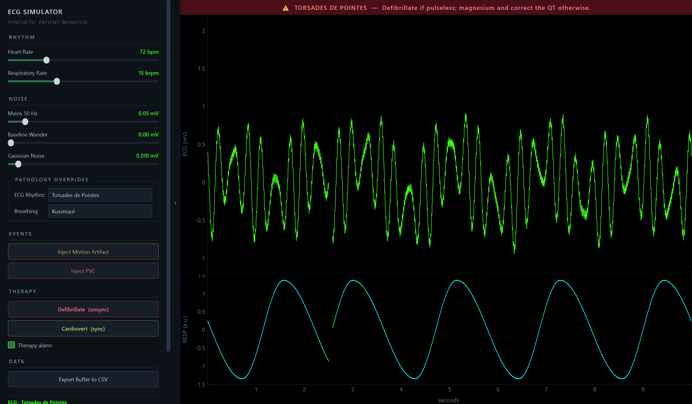
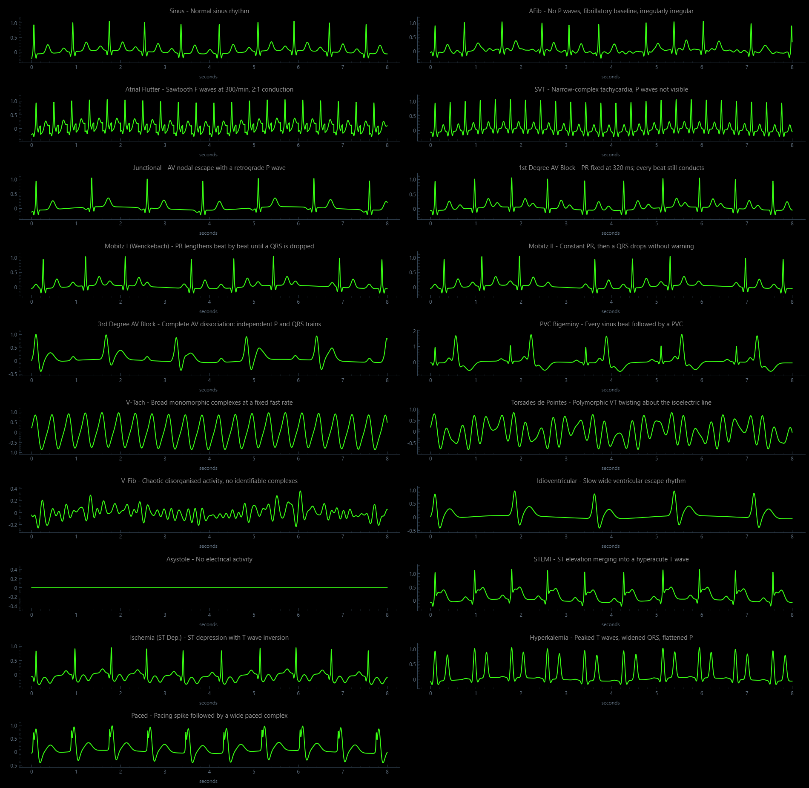
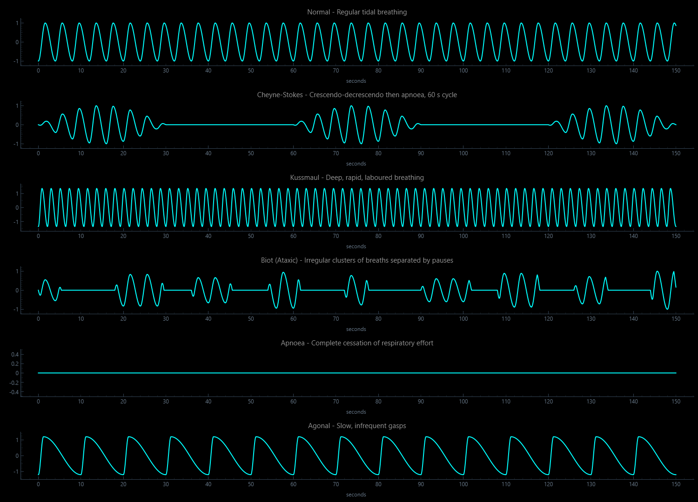
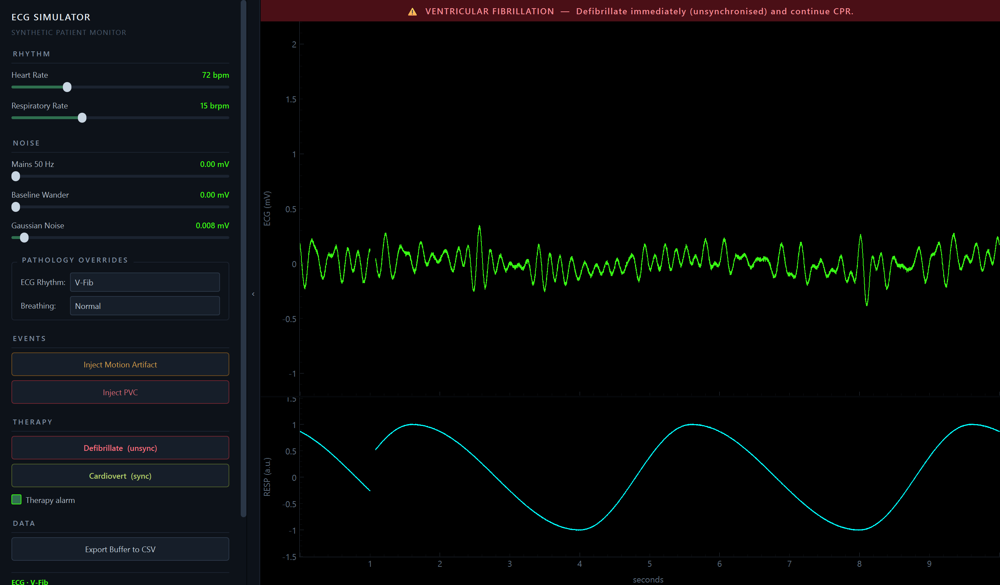
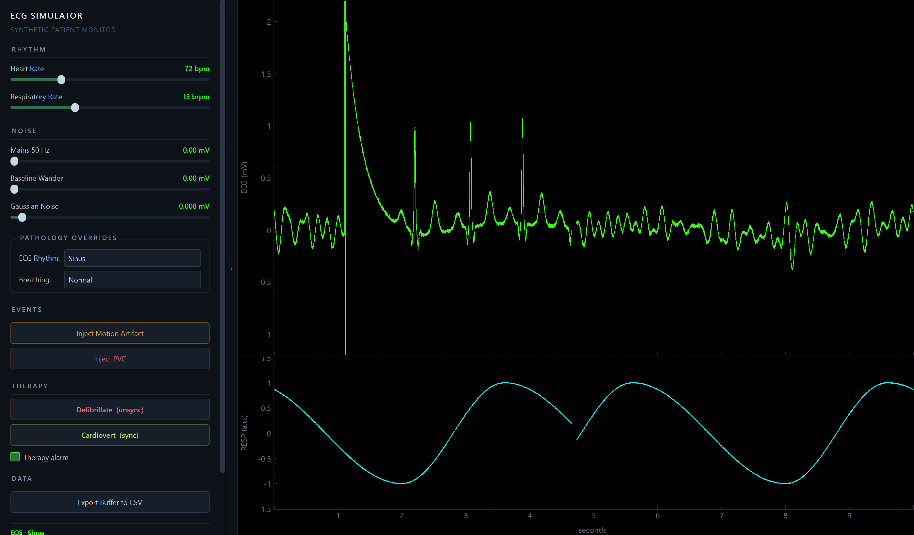

# ECG Simulator

A real-time patient monitor that generates synthetic ECG and respiration
waveforms — 19 cardiac rhythms, 6 breathing patterns, injectable artifacts, and
defibrillation — and draws them on a sweeping hospital-style display.

Built for teaching, demos, and testing signal-processing code against known
input. Nothing here comes from a real patient.



## Download

Prebuilt binaries are on the [Releases page](../../releases). Download the one
for your platform, unzip, and run — there is nothing to install.

| Platform | File |
|---|---|
| Windows 10/11 (64-bit) | `ECG-Simulator-windows-x64.zip` |
| macOS (Apple Silicon) | `ECG-Simulator-macos-arm64.zip` |

Intel Macs have no prebuilt binary — an Intel machine cannot run an Apple
Silicon build, so run it from source instead (below).

The binaries are not code-signed, so both operating systems will object the
first time:

- **macOS** — right-click the app and choose **Open**, then confirm. (Double-clicking
  will only offer to move it to the bin.) Or from a terminal:
  `xattr -dr com.apple.quarantine "ECG Simulator.app"`
- **Windows** — SmartScreen shows "Windows protected your PC". Choose
  **More info → Run anyway**.

## Run from source

```bash
pip install -r requirements.txt
python main.py
```

Python 3.10 or newer. Developed against Python 3.14 with PyQt6 6.11,
pyqtgraph 0.14, numpy 2.5 and scipy 1.18 (scipy is only needed for the tests).

## Using it

The left panel drives everything; the monitor sweeps a 10-second window.

**Rhythm and breathing.** Two dropdowns under *Pathology Overrides* switch the
cardiac rhythm and the breathing pattern live. A description under the Export
button explains what the current selection changes — including when a rhythm
takes over the rate and leaves the Heart Rate slider inactive.

**Sliders.** Heart rate (30–200 bpm), respiratory rate (8–30 breaths/min), and
three noise sources: 50 Hz mains hum, 0.5 Hz baseline wander, and Gaussian
sensor noise.

**Events.** *Inject Motion Artifact* fires a transient that swamps the trace and
recovers. *Inject PVC* drops in one premature ventricular contraction, coupled
to the preceding beat and followed by a compensatory pause.

**Therapy.** *Defibrillate* delivers an unsynchronised shock; *Cardiovert*
delivers one synchronised to the R wave. Outcomes are not guaranteed and the
result is reported in the status line.

**Export Buffer to CSV** writes the visible 10 seconds — time, ECG, respiration
at 1 kHz — for analysis elsewhere.

`Ctrl+H` or `F9` collapses the control panel and gives the whole width to the
monitor. The thin rail on its edge brings it back.

## What it can show

### Cardiac rhythms

| | |
|---|---|
| Normal | Sinus |
| Atrial | AFib, Atrial Flutter, SVT, Junctional |
| Conduction blocks | 1st Degree, Mobitz I (Wenckebach), Mobitz II, 3rd Degree |
| Ventricular | PVC Bigeminy, V-Tach, Torsades de Pointes, V-Fib, Idioventricular, Asystole |
| Ischaemic / metabolic | STEMI, Ischemia (ST depression), Hyperkalemia |
| Device | Paced |



The conduction blocks are modelled as conduction, not just as a different beat
shape: Wenckebach's PR interval lengthens by a shrinking increment until a QRS
is dropped, and complete heart block runs the atria and ventricles on
independent clocks so the P waves drift through the cycle.

### Breathing patterns

Normal, Cheyne-Stokes, Kussmaul, Biot (ataxic), apnoea, and agonal gasping.



### Electrical therapy

Defibrillation and synchronised cardioversion behave the way the equipment
does, which is most of the point of simulating them:

- **Asystole is never shockable.** It does not matter how many times you press
  the button — a flat line needs CPR, not electricity.
- **Cardioversion cannot synchronise without an R wave.** Attempt it in VF and
  the shock is simply not delivered.
- **An unsynchronised shock into an organised rhythm can induce VF** by landing
  on the T wave. That is the reason cardioversion is synchronised at all.

Shocks succeed probabilistically rather than always working, and the outcome is
stated plainly, so a failed shock reads as a modelled result rather than a bug.

A therapy alarm flags rhythms that call for intervention — flashing red for
arrest rhythms, steady amber for unstable-but-perfusing ones. It sits above the
monitor so it stays visible when the control panel is collapsed, and it can be
switched off.




The second image reads left to right as a single sweep: VF, the discharge
artifact, the amplifier recovering from saturation, a post-shock pause, and
sinus rhythm returning.

## How it works

Each heartbeat is a sum of five Gaussians — a simplified McSharry model — in the
order P, Q, R, S, T:

$$z(t) = \sum_i a_i \exp\left(\frac{-(t - \theta_i)^2}{2b_i^2}\right)$$

The P and T waves migrate toward the QRS as the rate rises, following Bazett's
square-root relationship, while the QRS keeps its width. Respiration is a
phase-warped asymmetric wave with a controllable inspiratory:expiratory ratio,
coupled back into the ECG both as respiratory sinus arrhythmia modulating the
R-R interval and as a slow baseline sway.

Generation and display run on separate threads with a ring buffer between them,
so a slow repaint can never stall the sample clock:

```
SignalGenerator (QThread) --writes--> RingBuffer <--reads-- MonitorView
     50 ms chunks                  10 s @ 1 kHz          QTimer, 30 FPS
```

The display does not scroll. The x-axis is fixed at 0–10 s and the trace stays
where it was drawn; a block of `NaN` samples is blanked just ahead of the write
cursor, so what travels across the screen is the *gap* — the erase bar of a real
monitor.

```
main.py              entry point
core/state.py        thread-safe parameter state and one-shot event flags
core/buffer.py       fixed-size multi-channel ring buffer
core/pathology.py    catalogue: morphologies, rhythms, breathing, therapy
core/generator.py    waveform engine and producer thread
ui/main_window.py    control panel, layout, therapy and alarm
ui/monitor.py        sweep renderer
```

`core/pathology.py` is a data table. Adding a rhythm means editing that file
rather than the engine; the dropdown and the in-app description pick it up
automatically.

## Development

143 tests across seven suites. They assert on measurements taken back out of the
generated signal — R-R intervals, FFT bins, QRS widths, ensemble-averaged P wave
amplitudes — rather than on the fact that numbers came out.

```bash
python tests/test_core.py         # ring buffer, state
python tests/test_generator.py    # waveform models, producer thread
python tests/test_ui.py           # widgets, layout, panel collapse
python tests/test_sweep.py        # sweep cursor, wiring, CSV export
python tests/test_pathology.py    # AFib, STEMI, V-Tach, Cheyne-Stokes
python tests/test_rhythms.py      # the full catalogue
python tests/test_therapy.py      # defibrillation, cardioversion, alarm
```

They also run under `pytest`. The GUI suites need a real window server; the
other two run headless.

Three preview tools render the waveforms and the app to PNG for inspection:

```bash
python tests/preview_waveforms.py
python tests/preview_pathology.py
python tests/preview_window.py out.png AFib Cheyne-Stokes
```

### Building

```bash
pip install pyinstaller
python packaging/make_icon.py     # optional, Windows icon
pyinstaller ECG-Simulator.spec --noconfirm --clean
```

Windows produces a single `dist/ECG-Simulator.exe`; macOS produces
`dist/ECG Simulator.app`. PyInstaller does not cross-compile, so each platform's
binary has to be built on that platform — the GitHub Actions workflow in
`.github/workflows/release.yml` does all three on hosted runners.

## Not a medical device

Every waveform here is synthetic and hand-parameterised. It is not derived from
patient data, has not been validated against any clinical standard, and must not
be used for diagnosis, for training that substitutes for clinical instruction,
or to test equipment intended for patient care.
